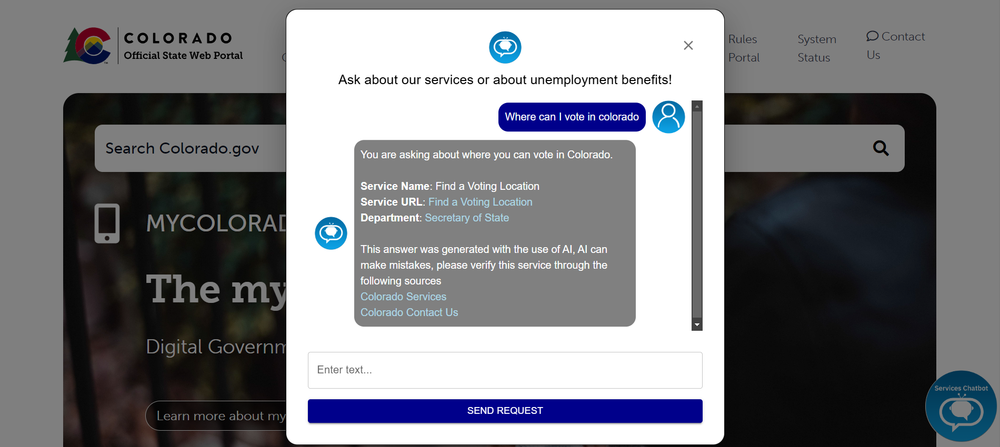
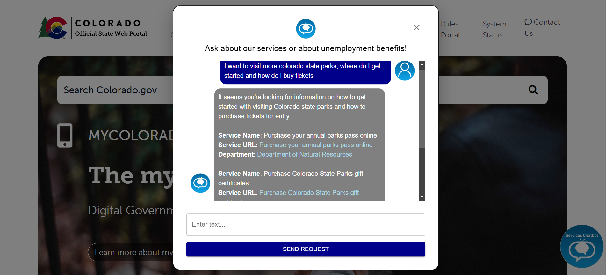
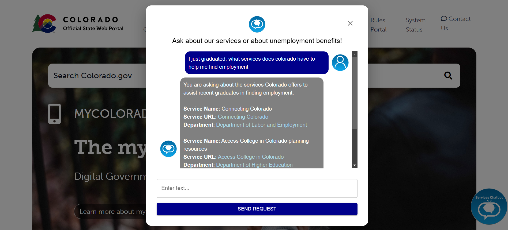
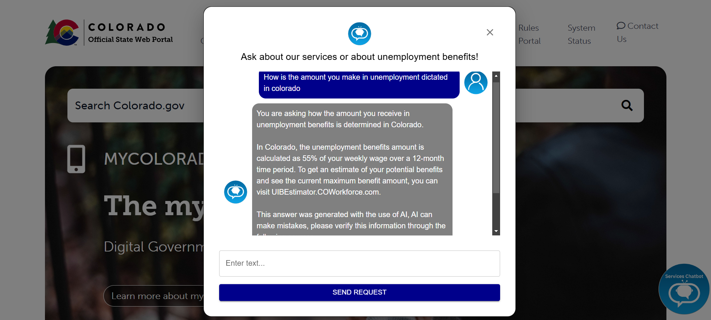
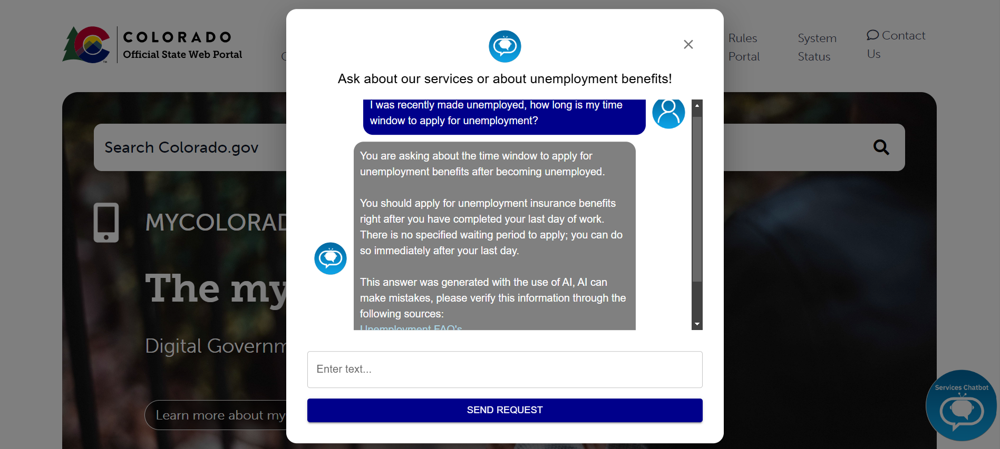
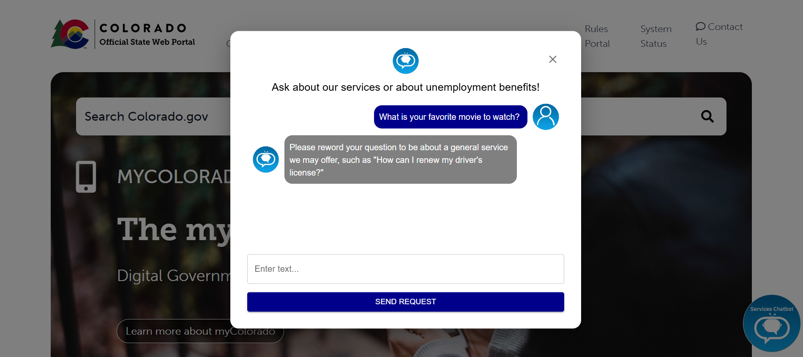

**Overview:**  
A demo Colorado.gov RAG chatbot that uses advanced RAG techniques such as classification, chat summarization, re-ranking, custom guardrails, and more. The purpose is to connect users with government services as well as to answer questions specific to unemployment and the Colorado UI Claimant Guide. Included are also tools used to scrape the services from Colorado.gov and compose a question-service map to improve the accuracy of answers and the variety of questions that are answerable.  

**Images:**  
Services Questions:  
  
  
  

Unemployment Questions:  
  
  

Classification of unrelated questions:  
  

**How to start:**  
1. Launch Docker.  
2. Make a virtual environment (`.venv`) and activate it.  
3. Fill out `example.env.example` with API keys and rename it `.env`.  
4. Go to `Chatbot/app`.  
5. Run `docker compose up --build`.  
6. Open [http://localhost:5555/](http://localhost:5555/) in your browser.  
7. At the end of the session, go to `Chatbot/app` and run `python clear_tables.py`.  
